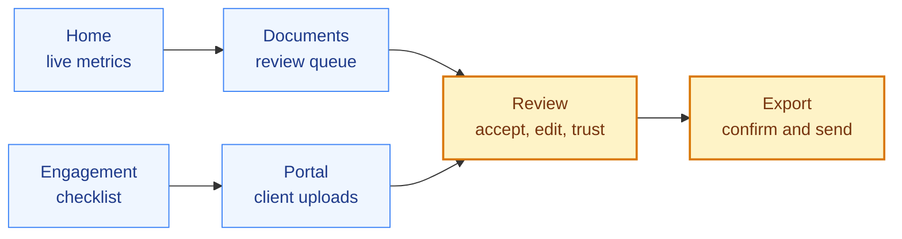
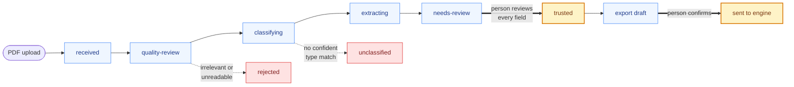
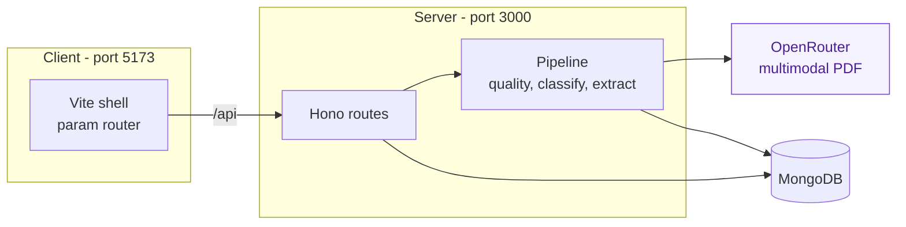

# Tax Docs

**Document collection, extraction, and review for tax teams and CPA firms.**

Collect client documents, classify and extract them with an AI pipeline, review every field with a human in the loop, and hand a payload to a tax engine.


[Quick start](#quick-start) - [Demo walkthrough](#demo-walkthrough) - [Pipeline](#pipeline) - [Architecture](#architecture) - [Configuration](#configuration) - [Scripts](#scripts) - [API](#api-reference)

---

## Quick start

**1. Install Bun** - the only required runtime. No Node, no npm, no database install.

```powershell
powershell -c "irm bun.sh/install.ps1 | iex"   # Windows
curl -fsSL https://bun.sh/install | bash       # macOS / Linux
```

**2. Install dependencies**

```bash
bun install
```

**3. Add an OpenRouter key** - needed only to upload documents.

```bash
cp .env.example .env.local   # then set OPENROUTER_API_KEY
```

Bun loads `.env.local` automatically. Without a key the app boots and every seeded page works, but an upload lands on `failed` with `OPENROUTER_API_KEY is not configured`.

**4. Run it**

```bash
bun run dev
```

| Service | URL |
|---------|-----|
| Client (Vite, proxies `/api`) | <http://localhost:5173> |
| API (Hono) | <http://127.0.0.1:3000> |

The API starts an embedded in-memory MongoDB and seeds the demo book on first boot. Data disappears when the process exits.

<details>
<summary>Optional: persistent MongoDB via Docker</summary>

```bash
bun run db:up                # start MongoDB
# set MONGODB_URI=mongodb://127.0.0.1:27017 in .env.local
bun run seed                 # or: bun run seed -- --reset
bun run dev
```

`bun run db:down` stops the container.

</details>

---

## Demo walkthrough

Ten minutes, end to end. Steps 1-4 and 8-9 need no API key; 5-7 upload documents and do.



Amber steps need a person. Everything else runs on its own.

**1. Home** - <http://localhost:5173>. Metrics are computed live from the database. `documentsAutoProcessed` and the straight-through rate count **trusted** documents only, so a document in review never inflates them.

**2. Documents** - the review queue at `?tab=needs-review`. Three seeded Alder Creek documents are waiting: a P&L and two Schedule K-1s.

**3. Review** - open `alder-creek-profit-and-loss-2025.pdf`. Every field carries a value, a confidence bucket, and a citation in an editable input. Fix anything that is wrong, then **Mark trusted** (top right); unedited values are accepted as extracted. The model proposes, a person decides.

**4. Engagement workspace** - **Engagements > Northgate Millwork, Inc.** (1120-S, 2025). Seven-item checklist, two trusted documents, validation summary, **Copy portal link**.

**5. Client portal** - <http://localhost:5173/portal/portal-northgate-millwork-inc-2025>. Deliberately chromeless: no sidebar, no other clients. An unknown token returns 404, not 403. The Messages panel on the right carries the same thread as the firm's Inbox.

Drop `demo-docs/northgate-profit-and-loss-2025.pdf` on it. Watch the status advance; the checklist item flips to `received` and the document joins the review queue.

**6. The bait documents** - a pipeline that only ever succeeds is not worth trusting.

| Upload | Outcome | What to see |
|--------|---------|-------------|
| `lease-agreement.pdf` | `rejected` | A real lease with no tax figures. Quality review rejects it as `irrelevant` and says why. |
| `state-apportionment-schedule.pdf` | `unclassified` | A real working paper with no registered type. Nothing is force-fitted - click **Define document type** and the model drafts a schema, then re-runs. |

**7. Validations** - upload and trust the four Northgate Forms 941, then return to the engagement. `Payroll ties to P&L` now warns: 1,218,500 of wages against 1,200,000 of payroll, the pack's one planted discrepancy. Validations warn; they never block.

**8. Export** - the draft is a live view of the trusted documents, not a snapshot: every line you trusted in the steps above is mapped by the time you open it, and lines with no trusted source stay honestly empty. Then **Confirm & send to tax engine**. The engagement moves to `exported` and the JSON payload becomes downloadable. Nothing reaches an engine without this click.

**9. Inbox and Settings** - the client conversation threads (reply to Northgate's unread question live from the compose box), and the eight seeded document types plus anything you drafted in step 6.

**10. Verify the live pipeline** - `bun run smoke` pushes the P&L, the lease, and the apportionment schedule through the real pipeline and asserts all three outcomes. It spends real tokens, so it stays out of `bun test`.

### The demo book

Seeded from `demo-docs/figures.json`, so seeded values match the figures printed on the tracked PDFs. Every entity, EIN, and amount is fictional.

| Client | Filing | State | Role |
|--------|--------|-------|------|
| Northgate Millwork, Inc. | 1120-S, 2025 | `collecting` | Hero - full source package, books tie |
| Alder Creek Design Studio LLC | 1065, 2025 | `in-review` | Documents already awaiting review |
| Summit Forge Components LLC | 1065, 2025 | `exported` | A finished engagement for contrast |

19 tracked PDFs live in `demo-docs/`. Regeneration is byte-for-byte idempotent: edit `scripts/generate-demo-docs.ts` and run `bun run demo-docs` - never edit the PDFs. Full inventory in [demo-docs/README.md](./demo-docs/README.md).

---

## Pipeline



An uncaught error at any stage lands on `failed`, carrying the real cause. `failed`, `rejected`, and `unclassified` all re-run.

Stages live in [src/server/pipeline/stages.ts](./src/server/pipeline/stages.ts). Every transition round-trips the whole document through its Zod schema before it persists.

**Autonomous:** ingest, quality review, classification, extraction, checklist matching.

**Requires a person:** marking a document trusted, sending to a tax engine, changing client master data.

Documents and filenames are untrusted input - they enter prompts inside delimited fences, never concatenated into a system prompt.

---

## Architecture



```text
design-system/   Tokens, CSS, visual catalog
src/server/      Hono API, config, MongoDB, pipeline, validation, seed, OpenRouter
src/client/      Vite app: shell chrome, param router, page registry, fetch layer
src/shared/      Zod schemas and constants shared by both sides
scripts/         Dev orchestration, seed, demo-docs generator, smoke
tests/           Bun test suite
demo-docs/       Tracked TY2025 document pack + figures.json ledger
```

Zod parses at every boundary: HTTP bodies, Mongo reads, extraction output, engine payloads. Wire shapes live in [src/shared/schemas/api.ts](./src/shared/schemas/api.ts), so a row gains a field in exactly one place and both sides parse the same schema.

---

## Configuration

Read in exactly one place: [src/server/config.ts](./src/server/config.ts).

| Variable | Default | Required | Notes |
|----------|---------|----------|-------|
| `OPENROUTER_API_KEY` | none | For uploads | Live pipeline and `bun run smoke` |
| `OPENROUTER_MODEL` | `google/gemini-3.7-flash` | No | Any slug with PDF + structured output |
| `MONGODB_URI` | none | No | Unset means in-memory MongoDB |
| `MONGODB_DB` | `tax_docs` | No | |
| `PORT` | `3000` | No | API only; Vite is fixed at `5173` |
| `NODE_ENV` | `development` | No | |
| `UPLOADS_DIR` | `data/uploads` | No | Runtime uploads (git-ignored) |

Secrets go only into the client library - never a log, error, URL, or client payload.

---

## Scripts

```bash
bun run dev          # API :3000 + Vite :5173
bun run dev:server   # API only
bun run dev:client   # Vite only
bun run seed         # seed if empty (-- --reset to rebuild)
bun run demo-docs    # regenerate demo-docs/
bun run smoke        # live pipeline check (costs tokens)
bun test
bun run typecheck
bun run build
bun run preview
bun run db:up        # Docker MongoDB (db:down to stop)
```

**Quality gate:** `bun run typecheck && bun test && bun run build`. All three pass before a change is done; `smoke` stays out because it spends tokens.

Tests run on `bun:test` and mock only at system boundaries. Persistence tests use the real driver against in-memory Mongo. See [.cursor/rules/testing.mdc](./.cursor/rules/testing.mdc).

---

## API reference

<details>
<summary><strong>All endpoints</strong></summary>

**Health and samples**

- `GET /api/health` - service and database status
- `GET /api/records` and `POST /api/records`

**Clients**

- `GET /api/clients` and `POST /api/clients`
- `GET /api/clients/:id` - client plus engagements
- `PATCH /api/clients/:id`

**Engagements**

- `GET /api/engagements` - list with client name and counts
- `POST /api/engagements` - create, with optional checklist items; a checklist opens the client conversation with the request as the first message
- `GET /api/engagements/:id` - detail: client, items, documents, activity
- `PATCH /api/engagements/:id` - update status
- `POST /api/engagements/:id/request-items`
- `PATCH` and `DELETE /api/engagements/:id/request-items/:itemId`
- `GET /api/engagements/:id/validations` - warn-only cross-document checks

**Exports**

- `POST /api/engagements/:id/export` - build a draft
- `GET /api/engagements/:id/export` - latest export; an outstanding draft is remapped from the currently trusted documents on read, a `sent` export is returned verbatim
- `POST /api/exports/:id/confirm` - human-confirmed send
- `GET /api/exports/:id/payload` - download the confirmed JSON

**Documents**

- `GET /api/documents` - `group=needs-review|approved|all`
- `POST /api/documents` - CPA upload (`file`, `engagementId`, optional `requestItemId`)
- `GET /api/documents/:id` - document plus type when classified
- `GET /api/documents/:id/file` - stored PDF bytes
- `PATCH /api/documents/:id/fields/:key` - edit a field (`{ action: "edit", value }`)
- `POST /api/documents/:id/trust` - mark trusted; auto-finalizes unreviewed fields as accepted
- `POST /api/documents/:id/rerun` - `failed`, `unclassified`, or `rejected`
- `POST /api/documents/:id/reclassify` - reviewer overrides a mis-classification with `{ documentTypeId }` (`needs-review` or `unclassified` only); clears extraction and re-extracts against the chosen type without re-running classify
- `POST /api/documents/:id/draft-type` - propose a schema, not persisted

**Types and templates**

- `GET /api/document-types` and `POST /api/document-types`
- `GET /api/document-types/:id` and `PATCH /api/document-types/:id`
- `GET /api/request-templates` and `PATCH /api/request-templates/:id`

**Portal**

- `GET /api/portal/:token` - checklist state (items required-first, then title) with per-item nested `documents`, top-level `unmatched` uploads, and the full `messages` thread oldest-first; serving it marks the firm's messages read; 404 on unknown token
- `POST /api/portal/:token/upload`
- `POST /api/portal/:token/items/:itemId/waive` - client marks an item not needed, optional note (409 unless the item is open)
- `POST /api/portal/:token/messages` - client sends a message `{ body }` (1-2000 chars), 201 with the created message
- `GET /api/portal/:token/documents/:documentId/file` - token-scoped PDF, 404 outside the token's engagement

**Inbox and metrics**

- `GET /api/inbox` - conversation threads (one per engagement with messages or visible activity): client/engagement head fields, a chronological timeline of messages interleaved with quiet system events, and the engagement's `documents` (newest first) for the files panel
- `GET /api/inbox/unread-count` - count of threads with unread client messages or unread inbound activity (the CPA's own outbound never counts)
- `POST /api/inbox/threads/:engagementId/messages` - CPA sends a message `{ body }`, 201 with the created message
- `POST /api/inbox/threads/:engagementId/read` - marks the thread's client messages and visible activity read, 204
- `GET /api/metrics` - `documentsAutoProcessed`, `fieldsAwaitingReview`, `straightThroughRate`, `needsReviewCount`, `outstandingRequests`, `activeClients`

**Search**

- `GET /api/search?q=` - powers the command palette (Ctrl+K): case-insensitive literal substring match across clients (name, EIN), engagements (client, year, filing type), documents (filename, type, client), and document types (name, description), capped at 8 rows per group

`documentsAutoProcessed` and `straightThroughRate` count **trusted** documents only. Straight-through is `round(100 * trusted / terminal-ish)`, and `0` on an empty denominator; terminal-ish is `needs-review`, `trusted`, `rejected`, `unclassified`, `failed`.

</details>

---

## Further reading

| Document | Purpose |
|----------|---------|
| [AGENTS.md](./AGENTS.md) | Engineering discipline and invariants - start here to contribute |
| [design-system/docs/DESIGN.md](./design-system/docs/DESIGN.md) | Tokens, typography, components, product chrome |
| [demo-docs/README.md](./demo-docs/README.md) | Document pack: inventory, planted discrepancy, sources |
| [.cursor/rules/](./.cursor/rules) | Area contracts: server, data store, security, testing, UI |

Private prototype. Every client, EIN, address, and figure in this repository is fictional.
